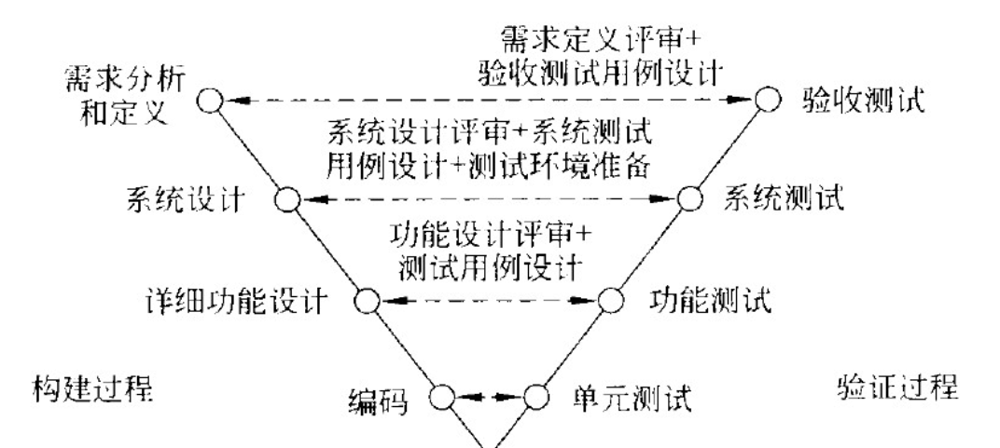
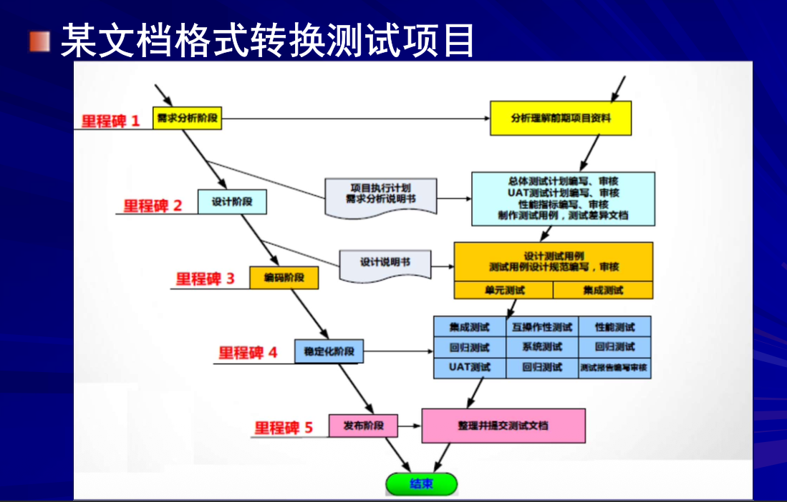
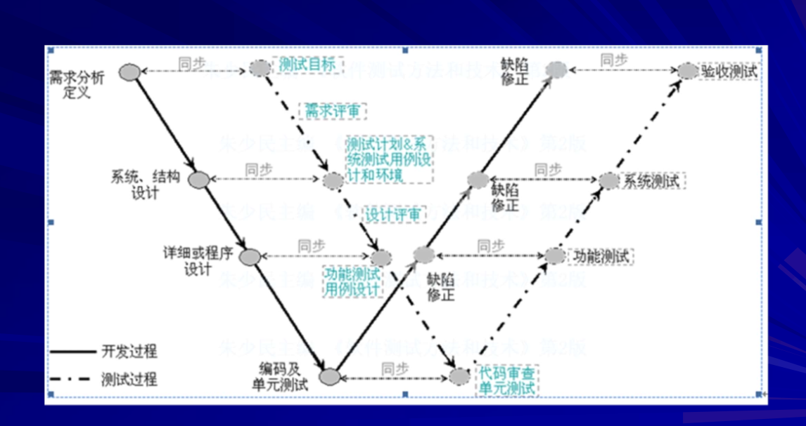
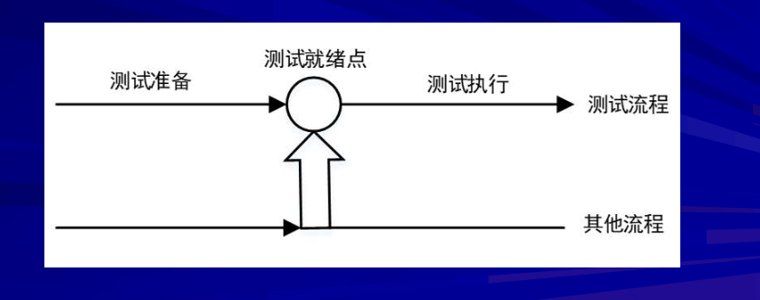
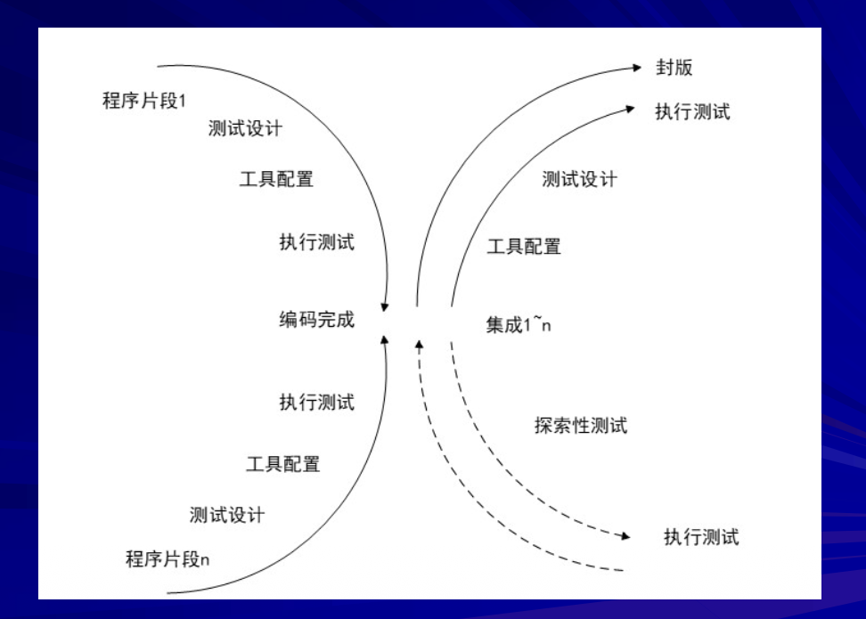

# 软件测试模型

这是选择题和判断题的高频考点，重点在于区分**不同模型的特点和优缺点**。

## 🎨 交互式可视化演示

<TestingModelDemo />

**使用说明**：
- 点击上方标签页切换不同的测试模型（V模型、W模型、H模型等）
- 鼠标悬停在可视化区域，查看对应关系和交互效果
- 右侧显示核心逻辑、考试要点和易错点

---

### 🅰️ V 模型 (V-Model)

*   **形态**：像一个V字。左边是开发阶段（需求->设计->编码），右边是测试阶段（单元->集成->系统->验收）。
*   **核心逻辑**：测试级别与开发阶段**一一对应**。
    *   单元测试 <--> 详细设计/编码
    *   集成测试 <--> 概要设计
    *   系统测试 <--> 需求分析
    *   验收测试 <--> 用户需求
*   **致命缺点（常考）**：**测试介入太晚**。它把测试看作是编码之后的最后一个阶段。如果需求阶段出错，要等到最后验收测试才发现，返工成本极高。
*   **局限性**：测试仅仅被视为开发活动结束后的一个阶段（代码完成后才开始），无法发现需求和设计阶段的早期错误。

**特点**：
- 开发与测试的线性对应关系
- 开发阶段与测试阶段一一对应

**局限性**：
- 测试介入晚
- 无法早期发现需求问题

**图示关系**：
```
需求分析 ←→ 验收测试
概要设计 ←→ 系统测试
详细设计 ←→ 集成测试
编码     ←→ 单元测试
```





### 🅱️ W 模型 (W-Model / 双V模型)

*   **形态**：两个V字并列。一个V是开发，一个V是测试。
*   **核心逻辑**：**测试与开发并行**。
*   **最大优点**：**测试尽早介入**。在需求分析阶段，测试人员就开始"测试需求"（审查文档）；在设计阶段，就开始"测试设计"。
*   **对象**：测试的对象不仅仅是程序，还包括**需求文档**和**设计文档**。
*   **进步**：强调测试不仅是测程序，还要测需求和设计（V&V原理）。测试尽早介入。
*   **局限性**：仍然视作串行活动，无法支持灵活的迭代和变更。

**特点**：
- 强调测试与开发并行
- 测试对象包含需求和设计
- 测试活动贯穿整个开发周期

**优势**：
- 早期介入测试
- 可以测试需求和设计文档



### 🅾️ H 模型 (H-Model) ⭐⭐ 主推模型

*   **核心逻辑**：**测试是一个独立的流程**。
*   **关键概念**：**测试就绪点**。只要测试准备工作做好了，测试就可以开始，不需要等开发完全结束。它强调测试的灵活性和微循环。
*   **结构**：分为"测试准备"和"测试执行"。
*   **优势**：体现了测试的独立性，测试流程与其他流程（开发）并发进行，支持迭代。

**特点**：
- 强调测试是独立的流程
- 有测试就绪点（Test Ready Point）
- 测试活动可以随时进行

**核心思想**：
- 测试准备完成后即可执行测试
- 不依赖于开发阶段的完成



### X 模型

*   **特点**：针对单独程序片段进行测试，引入**探索性测试**。
*   **优势**：更接近现实（如频繁交接、集成）。



### 测试过程改进模型 (TMM & TPI)

*   **CMM (能力成熟度模型)**：主要针对软件开发组织，分5级。
*   **TMM (测试能力成熟度模型)**：借鉴CMM，专门描述测试过程能力的成熟度，也是5级。
*   **TPI (测试过程改进)**：基于连续表示法，有20个关键过程域。
*   **CTP/STEP**：其他改进参考模型。

*理解逻辑*：从无序（初始级）-> 可重复 -> 已定义 -> 管理/量化 -> 优化。

### 软件测试标准

*   **标准定义**：公认机构制定，重复使用的规则/导则（是一把尺子）。
*   **层次**：国际标准(ISO)、国家标准(GB)、行业标准、企业标准等。
*   **ISO 9000-3**：适用于软件企业的质量管理标准。
*   **ISO vs. CMM**：
    *   ISO适用于所有制造业（含软件），CMM专用于软件行业。
    *   企业可以同时拿两个认证。

### 🚩 考试重点划红

**模型辨析 (客观题/判断题)**：
- **必须分清 V、W、H 模型**
- **考题形式**：给一段描述，判断是哪种模型；或者判断某个模型是否支持并行/迭代
- **易错点**：
    *   V模型不仅是测试执行，也是分阶段的，但它有一个致命弱点是"后置"
    *   W模型强调"并行"，测试对象包含需求和设计
    *   H模型强调"独立流程"和"测试准备与执行的分离"

**测试对象 (判断题)**：
- 软件测试的对象不仅仅是程序代码，还包括**需求文档、设计文档**等

**测试的介入时机**：
- 原则是**尽早开始**。W模型和H模型都支持这点，V模型不支持

> **来源文件**：`output_4_11_3.txt`，`output_4_12_3.txt`，课堂笔记（12月3日）